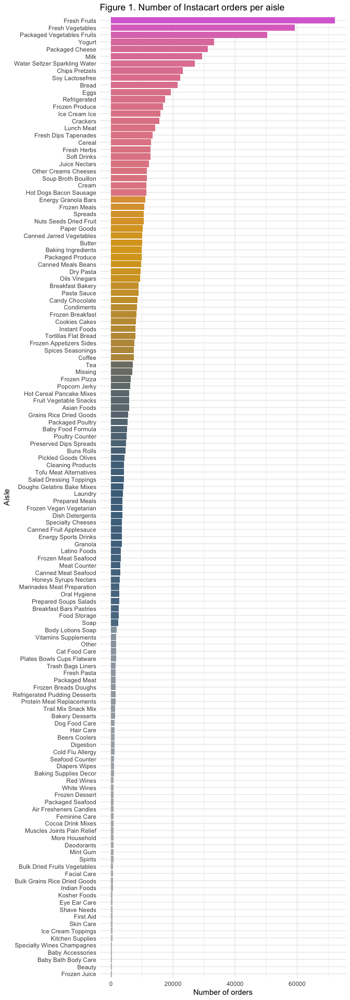
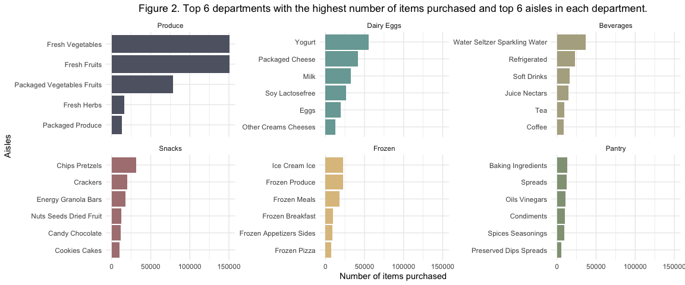

PUBH 7462 Homework 3
================
Kristin Elgersma
2/17/22

-   [Problem 3. Instacart](#problem-3-instacart)

# Problem 3. Instacart

``` r
# Read data
instacart <- read_csv("./data/instacart.csv")
```

## 3.1 Summary Table

``` r
# clean variable names
instacart <- janitor::clean_names(instacart)

instacart <- instacart %>%
  rename( # shorter names for some variables
    cart_order = add_to_cart_order,
    order_hour = order_hour_of_day,
    days_prior = days_since_prior_order
  )

# make factors
instacart$order_id <- as.factor(instacart$order_id)
instacart$product_id <- as.factor(instacart$product_id)
instacart$user_id <- as.factor(instacart$user_id)
instacart$aisle <- as.factor(instacart$aisle)
instacart$department <- as.factor(instacart$department)
instacart$aisle_id <- as.factor(instacart$aisle_id)
instacart$department_id <- as.factor(instacart$department_id)

# create data set
instacart2 <- instacart %>%
  group_by(order_id) %>%
  mutate(pct_reorder = (mean(reordered) * 100)) %>% # create % reordered variable
  group_by(order_id, order_number, days_prior, pct_reorder) %>%
  summarise(
    across(
      c(product_id, aisle_id, department_id),
      n_distinct
    )
  ) %>% # count the number of products, aisles, and departments for each order
  ungroup() %>%
  summarise(
    across(
      c(2:7),
      list(mean = mean, sd = sd, median = median), # get mean, median, sd for each variable of interest
      na.rm = TRUE,
      .names = "{.col}_{.fn}"
    )
  ) %>%
  pivot_longer(cols = c(1:18), names_to = "measure", values_to = "value") %>%
  separate(measure, c("A", "B", "C")) %>% # separate out the variable name and measure
  unite(name, c(A, B), sep = "_", remove = TRUE) %>% # reunite the variable name
  rename(measure = C) %>%
  pivot_wider(names_from = measure, values_from = c(value)) %>%
  mutate(
    name = factor(name),
    item = fct_recode(name, # rename the factor levels to read better in the table
      "Order number" = "order_number",
      "Days since last order" = "days_prior",
      "Percent of items reordered" = "pct_reorder",
      "Number of items purchased" = "product_id",
      "Number of aisles" = "aisle_id",
      "Number of departments" = "department_id"
    )
  )

# create the table
instacart2 %>%
  select(item, mean, sd, median) %>%
  gt() %>%
  tab_header("Table 1. Mean, SD, and median of Instacart data") %>%
  cols_align(
    align = c("left"),
    columns = item
  ) %>%
  cols_align(
    align = c("center"),
    columns = c(mean, sd, median)
  ) %>%
  cols_label(
    item = " ",
    mean = "Mean",
    sd = "SD",
    median = "Median"
  )
```

<div id="llbfddporh" style="overflow-x:auto;overflow-y:auto;width:auto;height:auto;">
<style>html {
  font-family: -apple-system, BlinkMacSystemFont, 'Segoe UI', Roboto, Oxygen, Ubuntu, Cantarell, 'Helvetica Neue', 'Fira Sans', 'Droid Sans', Arial, sans-serif;
}

#llbfddporh .gt_table {
  display: table;
  border-collapse: collapse;
  margin-left: auto;
  margin-right: auto;
  color: #333333;
  font-size: 16px;
  font-weight: normal;
  font-style: normal;
  background-color: #FFFFFF;
  width: auto;
  border-top-style: solid;
  border-top-width: 2px;
  border-top-color: #A8A8A8;
  border-right-style: none;
  border-right-width: 2px;
  border-right-color: #D3D3D3;
  border-bottom-style: solid;
  border-bottom-width: 2px;
  border-bottom-color: #A8A8A8;
  border-left-style: none;
  border-left-width: 2px;
  border-left-color: #D3D3D3;
}

#llbfddporh .gt_heading {
  background-color: #FFFFFF;
  text-align: center;
  border-bottom-color: #FFFFFF;
  border-left-style: none;
  border-left-width: 1px;
  border-left-color: #D3D3D3;
  border-right-style: none;
  border-right-width: 1px;
  border-right-color: #D3D3D3;
}

#llbfddporh .gt_title {
  color: #333333;
  font-size: 125%;
  font-weight: initial;
  padding-top: 4px;
  padding-bottom: 4px;
  border-bottom-color: #FFFFFF;
  border-bottom-width: 0;
}

#llbfddporh .gt_subtitle {
  color: #333333;
  font-size: 85%;
  font-weight: initial;
  padding-top: 0;
  padding-bottom: 6px;
  border-top-color: #FFFFFF;
  border-top-width: 0;
}

#llbfddporh .gt_bottom_border {
  border-bottom-style: solid;
  border-bottom-width: 2px;
  border-bottom-color: #D3D3D3;
}

#llbfddporh .gt_col_headings {
  border-top-style: solid;
  border-top-width: 2px;
  border-top-color: #D3D3D3;
  border-bottom-style: solid;
  border-bottom-width: 2px;
  border-bottom-color: #D3D3D3;
  border-left-style: none;
  border-left-width: 1px;
  border-left-color: #D3D3D3;
  border-right-style: none;
  border-right-width: 1px;
  border-right-color: #D3D3D3;
}

#llbfddporh .gt_col_heading {
  color: #333333;
  background-color: #FFFFFF;
  font-size: 100%;
  font-weight: normal;
  text-transform: inherit;
  border-left-style: none;
  border-left-width: 1px;
  border-left-color: #D3D3D3;
  border-right-style: none;
  border-right-width: 1px;
  border-right-color: #D3D3D3;
  vertical-align: bottom;
  padding-top: 5px;
  padding-bottom: 6px;
  padding-left: 5px;
  padding-right: 5px;
  overflow-x: hidden;
}

#llbfddporh .gt_column_spanner_outer {
  color: #333333;
  background-color: #FFFFFF;
  font-size: 100%;
  font-weight: normal;
  text-transform: inherit;
  padding-top: 0;
  padding-bottom: 0;
  padding-left: 4px;
  padding-right: 4px;
}

#llbfddporh .gt_column_spanner_outer:first-child {
  padding-left: 0;
}

#llbfddporh .gt_column_spanner_outer:last-child {
  padding-right: 0;
}

#llbfddporh .gt_column_spanner {
  border-bottom-style: solid;
  border-bottom-width: 2px;
  border-bottom-color: #D3D3D3;
  vertical-align: bottom;
  padding-top: 5px;
  padding-bottom: 5px;
  overflow-x: hidden;
  display: inline-block;
  width: 100%;
}

#llbfddporh .gt_group_heading {
  padding: 8px;
  color: #333333;
  background-color: #FFFFFF;
  font-size: 100%;
  font-weight: initial;
  text-transform: inherit;
  border-top-style: solid;
  border-top-width: 2px;
  border-top-color: #D3D3D3;
  border-bottom-style: solid;
  border-bottom-width: 2px;
  border-bottom-color: #D3D3D3;
  border-left-style: none;
  border-left-width: 1px;
  border-left-color: #D3D3D3;
  border-right-style: none;
  border-right-width: 1px;
  border-right-color: #D3D3D3;
  vertical-align: middle;
}

#llbfddporh .gt_empty_group_heading {
  padding: 0.5px;
  color: #333333;
  background-color: #FFFFFF;
  font-size: 100%;
  font-weight: initial;
  border-top-style: solid;
  border-top-width: 2px;
  border-top-color: #D3D3D3;
  border-bottom-style: solid;
  border-bottom-width: 2px;
  border-bottom-color: #D3D3D3;
  vertical-align: middle;
}

#llbfddporh .gt_from_md > :first-child {
  margin-top: 0;
}

#llbfddporh .gt_from_md > :last-child {
  margin-bottom: 0;
}

#llbfddporh .gt_row {
  padding-top: 8px;
  padding-bottom: 8px;
  padding-left: 5px;
  padding-right: 5px;
  margin: 10px;
  border-top-style: solid;
  border-top-width: 1px;
  border-top-color: #D3D3D3;
  border-left-style: none;
  border-left-width: 1px;
  border-left-color: #D3D3D3;
  border-right-style: none;
  border-right-width: 1px;
  border-right-color: #D3D3D3;
  vertical-align: middle;
  overflow-x: hidden;
}

#llbfddporh .gt_stub {
  color: #333333;
  background-color: #FFFFFF;
  font-size: 100%;
  font-weight: initial;
  text-transform: inherit;
  border-right-style: solid;
  border-right-width: 2px;
  border-right-color: #D3D3D3;
  padding-left: 12px;
}

#llbfddporh .gt_summary_row {
  color: #333333;
  background-color: #FFFFFF;
  text-transform: inherit;
  padding-top: 8px;
  padding-bottom: 8px;
  padding-left: 5px;
  padding-right: 5px;
}

#llbfddporh .gt_first_summary_row {
  padding-top: 8px;
  padding-bottom: 8px;
  padding-left: 5px;
  padding-right: 5px;
  border-top-style: solid;
  border-top-width: 2px;
  border-top-color: #D3D3D3;
}

#llbfddporh .gt_grand_summary_row {
  color: #333333;
  background-color: #FFFFFF;
  text-transform: inherit;
  padding-top: 8px;
  padding-bottom: 8px;
  padding-left: 5px;
  padding-right: 5px;
}

#llbfddporh .gt_first_grand_summary_row {
  padding-top: 8px;
  padding-bottom: 8px;
  padding-left: 5px;
  padding-right: 5px;
  border-top-style: double;
  border-top-width: 6px;
  border-top-color: #D3D3D3;
}

#llbfddporh .gt_striped {
  background-color: rgba(128, 128, 128, 0.05);
}

#llbfddporh .gt_table_body {
  border-top-style: solid;
  border-top-width: 2px;
  border-top-color: #D3D3D3;
  border-bottom-style: solid;
  border-bottom-width: 2px;
  border-bottom-color: #D3D3D3;
}

#llbfddporh .gt_footnotes {
  color: #333333;
  background-color: #FFFFFF;
  border-bottom-style: none;
  border-bottom-width: 2px;
  border-bottom-color: #D3D3D3;
  border-left-style: none;
  border-left-width: 2px;
  border-left-color: #D3D3D3;
  border-right-style: none;
  border-right-width: 2px;
  border-right-color: #D3D3D3;
}

#llbfddporh .gt_footnote {
  margin: 0px;
  font-size: 90%;
  padding: 4px;
}

#llbfddporh .gt_sourcenotes {
  color: #333333;
  background-color: #FFFFFF;
  border-bottom-style: none;
  border-bottom-width: 2px;
  border-bottom-color: #D3D3D3;
  border-left-style: none;
  border-left-width: 2px;
  border-left-color: #D3D3D3;
  border-right-style: none;
  border-right-width: 2px;
  border-right-color: #D3D3D3;
}

#llbfddporh .gt_sourcenote {
  font-size: 90%;
  padding: 4px;
}

#llbfddporh .gt_left {
  text-align: left;
}

#llbfddporh .gt_center {
  text-align: center;
}

#llbfddporh .gt_right {
  text-align: right;
  font-variant-numeric: tabular-nums;
}

#llbfddporh .gt_font_normal {
  font-weight: normal;
}

#llbfddporh .gt_font_bold {
  font-weight: bold;
}

#llbfddporh .gt_font_italic {
  font-style: italic;
}

#llbfddporh .gt_super {
  font-size: 65%;
}

#llbfddporh .gt_footnote_marks {
  font-style: italic;
  font-weight: normal;
  font-size: 65%;
}
</style>
<table class="gt_table">
  <thead class="gt_header">
    <tr>
      <th colspan="4" class="gt_heading gt_title gt_font_normal gt_bottom_border" style>Table 1. Mean, SD, and median of Instacart data</th>
    </tr>
    
  </thead>
  <thead class="gt_col_headings">
    <tr>
      <th class="gt_col_heading gt_columns_bottom_border gt_left" rowspan="1" colspan="1"> </th>
      <th class="gt_col_heading gt_columns_bottom_border gt_center" rowspan="1" colspan="1">Mean</th>
      <th class="gt_col_heading gt_columns_bottom_border gt_center" rowspan="1" colspan="1">SD</th>
      <th class="gt_col_heading gt_columns_bottom_border gt_center" rowspan="1" colspan="1">Median</th>
    </tr>
  </thead>
  <tbody class="gt_table_body">
    <tr><td class="gt_row gt_left">Order number</td>
<td class="gt_row gt_center">16.6</td>
<td class="gt_row gt_center">16.7</td>
<td class="gt_row gt_center">10</td></tr>
    <tr><td class="gt_row gt_left">Days since last order</td>
<td class="gt_row gt_center">17.0</td>
<td class="gt_row gt_center">10.7</td>
<td class="gt_row gt_center">15</td></tr>
    <tr><td class="gt_row gt_left">Percent of items reordered</td>
<td class="gt_row gt_center">60.2</td>
<td class="gt_row gt_center">30.7</td>
<td class="gt_row gt_center">63</td></tr>
    <tr><td class="gt_row gt_left">Number of items purchased</td>
<td class="gt_row gt_center">10.6</td>
<td class="gt_row gt_center">7.9</td>
<td class="gt_row gt_center">9</td></tr>
    <tr><td class="gt_row gt_left">Number of aisles</td>
<td class="gt_row gt_center">7.6</td>
<td class="gt_row gt_center">5.0</td>
<td class="gt_row gt_center">7</td></tr>
    <tr><td class="gt_row gt_left">Number of departments</td>
<td class="gt_row gt_center">4.9</td>
<td class="gt_row gt_center">2.6</td>
<td class="gt_row gt_center">5</td></tr>
  </tbody>
  
  
</table>
</div>

## 3.2 Visual display of number of orders

``` r
# create df with number of orders
instacart2 <- instacart %>%
  group_by(aisle) %>%
  summarise(n = n_distinct((order_id))) %>%
  mutate(aisle = str_to_title(aisle)) %>%
  mutate(aisle = as.factor(aisle)) %>%
  mutate(aisle = (fct_reorder(aisle, n)))

# Visualization
instacart2 %>%
  ggplot(aes(x = n, y = aisle, fill = n)) +
  geom_col() +
  scale_fill_gradientn( # choose custom colors and cut points for color scale
    name = "Number of orders",
    colors = c("gray", "skyblue4", "goldenrod", "orchid"),
    values = scales::rescale(c(0, 2000, 2001, 7000, 7001, 11000, 11001, max(instacart2$n)))
  ) +
  labs(
    title = "Figure 1. Number of Instacart orders per aisle",
    x = "Number of orders",
    y = "Aisle"
  ) +
  theme_minimal() +
  theme(legend.position = "none")
```



## 3.3 Visualization of the top 6 aisles in the top 6 departments by items purchased

``` r
# get top 6 departments
insta_dep6 <- instacart %>%
  group_by(department) %>%
  summarise(dept_tot = n()) %>%
  arrange(desc(dept_tot)) %>%
  slice(1:6) %>%
  ungroup()

# get top 6 aisles
insta_aisle6 <- instacart %>%
  filter(department %in% insta_dep6$department) %>% # filter departments to only include those in the top 6
  group_by(department, aisle) %>%
  summarise(aisle_tot = n()) %>%
  arrange(desc(aisle_tot)) %>%
  slice(1:6) %>% # keep only top 6 aisles
  mutate(
    aisle = str_to_title(aisle),
    department = str_to_title(department)
  ) %>%
  ungroup() %>%
  mutate(
    aisle = fct_reorder(aisle, aisle_tot),
    department = fct_reorder(department, desc(aisle_tot))
  )


# Visualization
insta_aisle6 %>%
  ggplot(aes(x = aisle_tot, y = aisle, fill = department)) +
  geom_col() +
  facet_wrap(~department, scales = "free_y") +
  scale_fill_paletteer_d("ggthemes::excel_Feathered") +
  theme_minimal() +
  theme(legend.position = "none", plot.title = element_text(hjust = 0.5)) +
  labs(
    title = "Figure 2. Top 6 departments with the highest number of items purchased and top 6 aisles in each department.",
    y = "Aisles",
    x = "Number of items purchased"
  )
```



## 3.4 Table of top 5 aisles by items purchased and top 5 items purchased in these aisles

``` r
# get top 5 aisles
insta_aisle5 <- instacart %>%
  group_by(aisle) %>%
  summarise(aisle_tot = n()) %>%
  arrange(desc(aisle_tot)) %>%
  slice(1:5)

# get top 5 products
insta_prod5 <- instacart %>%
  filter(aisle %in% insta_aisle5$aisle) %>% # filter aisles to only include those in the top 5
  group_by(aisle, product_name) %>%
  summarise(product_tot = n()) %>%
  arrange(desc(product_tot)) %>%
  slice(1:5) %>% # keep only top 5 products
  ungroup() %>%
  mutate(
    aisle = str_to_title(aisle), # clean up titles
    product_name = str_to_title(product_name),
    product_name = fct_reorder(product_name, desc(product_tot)), # reorder factors highest to lowest
    aisle = fct_reorder(factor(aisle), desc(product_tot))
  )

# create the table
insta_prod5 %>%
  group_by(aisle) %>%
  arrange(aisle) %>%
  gt() %>%
  tab_header("Table 2. Top 5 aisles with the highest number of items purchased and top 5 products in each department.") %>%
  data_color(
    columns = product_tot,
    colors = scales::col_numeric(
      palette = c("white", "skyblue4"),
      domain  = c(0, 18000)
    )
  ) %>%
  cols_label(
    product_tot = "Number of Items",
    product_name = "Product Name"
  )
```

<div id="vydtdfffke" style="overflow-x:auto;overflow-y:auto;width:auto;height:auto;">
<style>html {
  font-family: -apple-system, BlinkMacSystemFont, 'Segoe UI', Roboto, Oxygen, Ubuntu, Cantarell, 'Helvetica Neue', 'Fira Sans', 'Droid Sans', Arial, sans-serif;
}

#vydtdfffke .gt_table {
  display: table;
  border-collapse: collapse;
  margin-left: auto;
  margin-right: auto;
  color: #333333;
  font-size: 16px;
  font-weight: normal;
  font-style: normal;
  background-color: #FFFFFF;
  width: auto;
  border-top-style: solid;
  border-top-width: 2px;
  border-top-color: #A8A8A8;
  border-right-style: none;
  border-right-width: 2px;
  border-right-color: #D3D3D3;
  border-bottom-style: solid;
  border-bottom-width: 2px;
  border-bottom-color: #A8A8A8;
  border-left-style: none;
  border-left-width: 2px;
  border-left-color: #D3D3D3;
}

#vydtdfffke .gt_heading {
  background-color: #FFFFFF;
  text-align: center;
  border-bottom-color: #FFFFFF;
  border-left-style: none;
  border-left-width: 1px;
  border-left-color: #D3D3D3;
  border-right-style: none;
  border-right-width: 1px;
  border-right-color: #D3D3D3;
}

#vydtdfffke .gt_title {
  color: #333333;
  font-size: 125%;
  font-weight: initial;
  padding-top: 4px;
  padding-bottom: 4px;
  border-bottom-color: #FFFFFF;
  border-bottom-width: 0;
}

#vydtdfffke .gt_subtitle {
  color: #333333;
  font-size: 85%;
  font-weight: initial;
  padding-top: 0;
  padding-bottom: 6px;
  border-top-color: #FFFFFF;
  border-top-width: 0;
}

#vydtdfffke .gt_bottom_border {
  border-bottom-style: solid;
  border-bottom-width: 2px;
  border-bottom-color: #D3D3D3;
}

#vydtdfffke .gt_col_headings {
  border-top-style: solid;
  border-top-width: 2px;
  border-top-color: #D3D3D3;
  border-bottom-style: solid;
  border-bottom-width: 2px;
  border-bottom-color: #D3D3D3;
  border-left-style: none;
  border-left-width: 1px;
  border-left-color: #D3D3D3;
  border-right-style: none;
  border-right-width: 1px;
  border-right-color: #D3D3D3;
}

#vydtdfffke .gt_col_heading {
  color: #333333;
  background-color: #FFFFFF;
  font-size: 100%;
  font-weight: normal;
  text-transform: inherit;
  border-left-style: none;
  border-left-width: 1px;
  border-left-color: #D3D3D3;
  border-right-style: none;
  border-right-width: 1px;
  border-right-color: #D3D3D3;
  vertical-align: bottom;
  padding-top: 5px;
  padding-bottom: 6px;
  padding-left: 5px;
  padding-right: 5px;
  overflow-x: hidden;
}

#vydtdfffke .gt_column_spanner_outer {
  color: #333333;
  background-color: #FFFFFF;
  font-size: 100%;
  font-weight: normal;
  text-transform: inherit;
  padding-top: 0;
  padding-bottom: 0;
  padding-left: 4px;
  padding-right: 4px;
}

#vydtdfffke .gt_column_spanner_outer:first-child {
  padding-left: 0;
}

#vydtdfffke .gt_column_spanner_outer:last-child {
  padding-right: 0;
}

#vydtdfffke .gt_column_spanner {
  border-bottom-style: solid;
  border-bottom-width: 2px;
  border-bottom-color: #D3D3D3;
  vertical-align: bottom;
  padding-top: 5px;
  padding-bottom: 5px;
  overflow-x: hidden;
  display: inline-block;
  width: 100%;
}

#vydtdfffke .gt_group_heading {
  padding: 8px;
  color: #333333;
  background-color: #FFFFFF;
  font-size: 100%;
  font-weight: initial;
  text-transform: inherit;
  border-top-style: solid;
  border-top-width: 2px;
  border-top-color: #D3D3D3;
  border-bottom-style: solid;
  border-bottom-width: 2px;
  border-bottom-color: #D3D3D3;
  border-left-style: none;
  border-left-width: 1px;
  border-left-color: #D3D3D3;
  border-right-style: none;
  border-right-width: 1px;
  border-right-color: #D3D3D3;
  vertical-align: middle;
}

#vydtdfffke .gt_empty_group_heading {
  padding: 0.5px;
  color: #333333;
  background-color: #FFFFFF;
  font-size: 100%;
  font-weight: initial;
  border-top-style: solid;
  border-top-width: 2px;
  border-top-color: #D3D3D3;
  border-bottom-style: solid;
  border-bottom-width: 2px;
  border-bottom-color: #D3D3D3;
  vertical-align: middle;
}

#vydtdfffke .gt_from_md > :first-child {
  margin-top: 0;
}

#vydtdfffke .gt_from_md > :last-child {
  margin-bottom: 0;
}

#vydtdfffke .gt_row {
  padding-top: 8px;
  padding-bottom: 8px;
  padding-left: 5px;
  padding-right: 5px;
  margin: 10px;
  border-top-style: solid;
  border-top-width: 1px;
  border-top-color: #D3D3D3;
  border-left-style: none;
  border-left-width: 1px;
  border-left-color: #D3D3D3;
  border-right-style: none;
  border-right-width: 1px;
  border-right-color: #D3D3D3;
  vertical-align: middle;
  overflow-x: hidden;
}

#vydtdfffke .gt_stub {
  color: #333333;
  background-color: #FFFFFF;
  font-size: 100%;
  font-weight: initial;
  text-transform: inherit;
  border-right-style: solid;
  border-right-width: 2px;
  border-right-color: #D3D3D3;
  padding-left: 12px;
}

#vydtdfffke .gt_summary_row {
  color: #333333;
  background-color: #FFFFFF;
  text-transform: inherit;
  padding-top: 8px;
  padding-bottom: 8px;
  padding-left: 5px;
  padding-right: 5px;
}

#vydtdfffke .gt_first_summary_row {
  padding-top: 8px;
  padding-bottom: 8px;
  padding-left: 5px;
  padding-right: 5px;
  border-top-style: solid;
  border-top-width: 2px;
  border-top-color: #D3D3D3;
}

#vydtdfffke .gt_grand_summary_row {
  color: #333333;
  background-color: #FFFFFF;
  text-transform: inherit;
  padding-top: 8px;
  padding-bottom: 8px;
  padding-left: 5px;
  padding-right: 5px;
}

#vydtdfffke .gt_first_grand_summary_row {
  padding-top: 8px;
  padding-bottom: 8px;
  padding-left: 5px;
  padding-right: 5px;
  border-top-style: double;
  border-top-width: 6px;
  border-top-color: #D3D3D3;
}

#vydtdfffke .gt_striped {
  background-color: rgba(128, 128, 128, 0.05);
}

#vydtdfffke .gt_table_body {
  border-top-style: solid;
  border-top-width: 2px;
  border-top-color: #D3D3D3;
  border-bottom-style: solid;
  border-bottom-width: 2px;
  border-bottom-color: #D3D3D3;
}

#vydtdfffke .gt_footnotes {
  color: #333333;
  background-color: #FFFFFF;
  border-bottom-style: none;
  border-bottom-width: 2px;
  border-bottom-color: #D3D3D3;
  border-left-style: none;
  border-left-width: 2px;
  border-left-color: #D3D3D3;
  border-right-style: none;
  border-right-width: 2px;
  border-right-color: #D3D3D3;
}

#vydtdfffke .gt_footnote {
  margin: 0px;
  font-size: 90%;
  padding: 4px;
}

#vydtdfffke .gt_sourcenotes {
  color: #333333;
  background-color: #FFFFFF;
  border-bottom-style: none;
  border-bottom-width: 2px;
  border-bottom-color: #D3D3D3;
  border-left-style: none;
  border-left-width: 2px;
  border-left-color: #D3D3D3;
  border-right-style: none;
  border-right-width: 2px;
  border-right-color: #D3D3D3;
}

#vydtdfffke .gt_sourcenote {
  font-size: 90%;
  padding: 4px;
}

#vydtdfffke .gt_left {
  text-align: left;
}

#vydtdfffke .gt_center {
  text-align: center;
}

#vydtdfffke .gt_right {
  text-align: right;
  font-variant-numeric: tabular-nums;
}

#vydtdfffke .gt_font_normal {
  font-weight: normal;
}

#vydtdfffke .gt_font_bold {
  font-weight: bold;
}

#vydtdfffke .gt_font_italic {
  font-style: italic;
}

#vydtdfffke .gt_super {
  font-size: 65%;
}

#vydtdfffke .gt_footnote_marks {
  font-style: italic;
  font-weight: normal;
  font-size: 65%;
}
</style>
<table class="gt_table">
  <thead class="gt_header">
    <tr>
      <th colspan="2" class="gt_heading gt_title gt_font_normal gt_bottom_border" style>Table 2. Top 5 aisles with the highest number of items purchased and top 5 products in each department.</th>
    </tr>
    
  </thead>
  <thead class="gt_col_headings">
    <tr>
      <th class="gt_col_heading gt_columns_bottom_border gt_center" rowspan="1" colspan="1">Product Name</th>
      <th class="gt_col_heading gt_columns_bottom_border gt_right" rowspan="1" colspan="1">Number of Items</th>
    </tr>
  </thead>
  <tbody class="gt_table_body">
    <tr class="gt_group_heading_row">
      <td colspan="2" class="gt_group_heading">Fresh Fruits</td>
    </tr>
    <tr><td class="gt_row gt_center">Banana</td>
<td class="gt_row gt_right" style="background-color: #808080; color: #000000;">18726</td></tr>
    <tr><td class="gt_row gt_center">Bag Of Organic Bananas</td>
<td class="gt_row gt_right" style="background-color: #64839B; color: #000000;">15480</td></tr>
    <tr><td class="gt_row gt_center">Organic Strawberries</td>
<td class="gt_row gt_right" style="background-color: #91A6B7; color: #000000;">10894</td></tr>
    <tr><td class="gt_row gt_center">Large Lemon</td>
<td class="gt_row gt_right" style="background-color: #ACBCC9; color: #000000;">8135</td></tr>
    <tr><td class="gt_row gt_center">Organic Avocado</td>
<td class="gt_row gt_right" style="background-color: #B3C2CE; color: #000000;">7409</td></tr>
    <tr class="gt_group_heading_row">
      <td colspan="2" class="gt_group_heading">Packaged Vegetables Fruits</td>
    </tr>
    <tr><td class="gt_row gt_center">Organic Baby Spinach</td>
<td class="gt_row gt_right" style="background-color: #9CAFBF; color: #000000;">9784</td></tr>
    <tr><td class="gt_row gt_center">Organic Raspberries</td>
<td class="gt_row gt_right" style="background-color: #C6D1DA; color: #000000;">5546</td></tr>
    <tr><td class="gt_row gt_center">Organic Blueberries</td>
<td class="gt_row gt_right" style="background-color: #CCD5DE; color: #000000;">4966</td></tr>
    <tr><td class="gt_row gt_center">Seedless Red Grapes</td>
<td class="gt_row gt_right" style="background-color: #D5DDE4; color: #000000;">4059</td></tr>
    <tr><td class="gt_row gt_center">Organic Grape Tomatoes</td>
<td class="gt_row gt_right" style="background-color: #D8DFE5; color: #000000;">3823</td></tr>
    <tr class="gt_group_heading_row">
      <td colspan="2" class="gt_group_heading">Fresh Vegetables</td>
    </tr>
    <tr><td class="gt_row gt_center">Organic Cucumber</td>
<td class="gt_row gt_right" style="background-color: #D0D8E0; color: #000000;">4613</td></tr>
    <tr><td class="gt_row gt_center">Organic Zucchini</td>
<td class="gt_row gt_right" style="background-color: #D0D9E0; color: #000000;">4589</td></tr>
    <tr><td class="gt_row gt_center">Organic Yellow Onion</td>
<td class="gt_row gt_right" style="background-color: #D3DBE2; color: #000000;">4290</td></tr>
    <tr><td class="gt_row gt_center">Organic Garlic</td>
<td class="gt_row gt_right" style="background-color: #D4DCE3; color: #000000;">4158</td></tr>
    <tr><td class="gt_row gt_center">Asparagus</td>
<td class="gt_row gt_right" style="background-color: #D7DFE5; color: #000000;">3868</td></tr>
    <tr class="gt_group_heading_row">
      <td colspan="2" class="gt_group_heading">Packaged Cheese</td>
    </tr>
    <tr><td class="gt_row gt_center">Organic Whole String Cheese</td>
<td class="gt_row gt_right" style="background-color: #EAEEF2; color: #000000;">1993</td></tr>
    <tr><td class="gt_row gt_center">Grated Parmesan</td>
<td class="gt_row gt_right" style="background-color: #EDF1F4; color: #000000;">1694</td></tr>
    <tr><td class="gt_row gt_center">Feta Cheese Crumbles</td>
<td class="gt_row gt_right" style="background-color: #F0F3F5; color: #000000;">1449</td></tr>
    <tr><td class="gt_row gt_center">Organic Sticks Low Moisture Part Skim Mozzarella String Cheese</td>
<td class="gt_row gt_right" style="background-color: #F1F4F6; color: #000000;">1342</td></tr>
    <tr><td class="gt_row gt_center">Shredded Parmesan</td>
<td class="gt_row gt_right" style="background-color: #F1F4F6; color: #000000;">1324</td></tr>
    <tr class="gt_group_heading_row">
      <td colspan="2" class="gt_group_heading">Yogurt</td>
    </tr>
    <tr><td class="gt_row gt_center">Total 0% Greek Yogurt</td>
<td class="gt_row gt_right" style="background-color: #F4F6F8; color: #000000;">1046</td></tr>
    <tr><td class="gt_row gt_center">Total 0% Nonfat Greek Yogurt</td>
<td class="gt_row gt_right" style="background-color: #F5F7F8; color: #000000;">993</td></tr>
    <tr><td class="gt_row gt_center">Total 2% With Strawberry Lowfat Greek Strained Yogurt</td>
<td class="gt_row gt_right" style="background-color: #F5F7F8; color: #000000;">973</td></tr>
    <tr><td class="gt_row gt_center">Total Greek Strained Yogurt</td>
<td class="gt_row gt_right" style="background-color: #F5F7F9; color: #000000;">951</td></tr>
    <tr><td class="gt_row gt_center">Total 2% All Natural Greek Strained Yogurt With Honey</td>
<td class="gt_row gt_right" style="background-color: #F7F8FA; color: #000000;">810</td></tr>
  </tbody>
  
  
</table>
</div>
